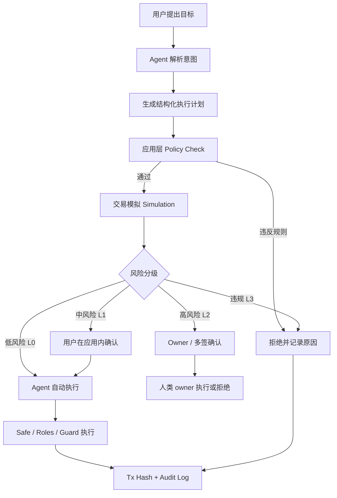

# 2026-05-28｜Week 2 Safe 学习笔记

## 今日学习任务

课程：**Week 2｜共学营：AI × Web3 交叉研究与方向选择**  
模块：**Wallet / Permission / Safe Execution**  
今天重点阅读课程中与 Safe 相关的推荐学习材料，并把它和 AgentScoope Wallet 的权限设计联系起来。

## 阅读材料

课程中和 Safe 直接相关的推荐材料：

- [Safe 是什么](https://docs.safe.global/home/what-is-safe)
- [Safe Smart Account Guards](https://docs.safe.global/advanced/smart-account-guards)

相关上下文材料：

- [ERC-4337 官方文档](https://eips.ethereum.org/EIPS/eip-4337)：账户抽象基础协议
- [ERC-7702 官方文档](https://eips.ethereum.org/EIPS/eip-7702)：EOA 临时获得智能账户能力的方向
- [Coinbase Policy Engine](https://help.coinbase.com/en/prime/onchain-wallet/onchain-policy-engine)：交易策略引擎参考
- [Cobo Agentic Wallet 开发者助手](https://www.cobo.com/products/agentic-wallet/manual/developer/quickstart-overview)：原生 Agent 钱包集成参考

## 课程模块 D 的核心问题

今天的重点不是“怎么调用签名 API”，而是：

> 当 Agent 参与链上动作时，权限如何授予、限制、撤销、审计和恢复？

我把课程里的几个问题整理成自己的理解：

1. **Agent 能做什么，不能做什么，要提前定义。**  
   不能只说“Agent 帮我转账”，而要明确预算、token、目标地址、可调用合约、操作类型、时间窗口和失败处理方式。

2. **自动执行和人工确认要分层。**  
   低风险动作可以自动执行；涉及大额资金、授权变更、未知合约、策略修改、主网真实资产时，必须暂停并请求人工确认。

3. **授权不是一次性动作。**  
   授权应该有范围、额度、时间和撤销方式。任务结束后，权限应该能失效或被收回。

4. **审计和恢复机制是产品的一部分。**  
   如果系统只会执行交易，但不能解释为什么执行、为什么拒绝、如何撤销、出了错怎么追踪，就不是可靠的 Agent Wallet。

## Safe 是什么：我的理解

Safe 的核心不是“一个更好看的钱包界面”，而是一套**智能账户基础设施**。

Safe 文档里强调，传统 EOA 有几个限制：

- seed phrase 很难安全保管；
- 单个私钥就是单点风险；
- 权限和恢复能力不够灵活；
- 很难支持复杂团队、组织或自动化场景。

Safe 的方向是把账户从单一私钥模型升级为智能账户：

- 可以支持多签；
- 可以通过模块扩展能力；
- 可以配合账户抽象；
- 可以把资产、身份、数据和操作权限放到更可控的结构里。

对 AI Agent 来说，这个点很关键：

> Agent 不应该直接拿主私钥，而应该只拿一个受限执行权限。

也就是说，Safe 可以作为底层金库和权限容器，Agent 只是一个被限制过的操作者。

## Safe Guards 是什么：我的理解

Safe Guards 是 Safe 交易执行前后的检查机制。

文档里的关键点：

- Guard 可以在交易执行前检查交易参数；
- Guard 也可以在交易执行后检查 Safe 的最终状态；
- Guard 适合在 n-of-m 多签之外增加额外限制；
- Guard 有能力阻止交易执行；
- 但如果 Guard 写坏了，也可能导致 Safe 无法正常交易，所以必须重视审计和恢复机制。

我对 Guard 的理解：

> Guard 像是 Safe 的安全门卫。即使签名人数满足了，如果交易不符合额外规则，也可以被挡住。

放到 Agent Wallet 里，Guard / policy 可以检查：

- 收款地址是否在白名单；
- token 是否允许；
- 单笔金额是否超限；
- 今日预算是否足够；
- 是否调用了不允许的合约或方法；
- 是否尝试无限 approve；
- 是否绕过了预期执行路径。

不过 Guard 本身也有风险：如果设计错误，可能造成 DoS，让 Safe 被卡住。所以真实产品里要有恢复路径，比如 owner 可以移除 Guard / 关闭模块 / 撤销角色。

## 为什么 Safe / Guard / Policy 对 AI Agent 很重要

AI Agent 的问题不是“会不会调用工具”，而是它可能会：

- 理解错用户意图；
- 被 prompt injection 诱导；
- 相信伪造的工具返回；
- 生成错误交易；
- 被要求给陌生地址转账；
- 尝试执行超过授权范围的操作。

如果 Agent 直接持有私钥，这些问题都会变成资产风险。

Safe + policy 的价值是把风险放到基础设施层拦住：

- Agent 可以提出意图和交易计划；
- 应用层先做 policy check；
- 链上或钱包层再做权限限制；
- 高风险动作必须 human-in-the-loop；
- 超出范围直接拒绝；
- 执行和拒绝都留下审计记录。

这比“相信 Agent 不会犯错”可靠得多。

## AgentScoope Wallet 的对应设计

结合我现在的 AgentScoope Wallet，Safe 可以对应几个角色：

- **Safe**：项目金库 / 用户资产容器；
- **Agent EOA**：受限操作者，不是 owner；
- **Zodiac Roles / Module**：定义 Agent 可以调用哪些目标、方法和 token；
- **App Policy**：检查白名单、单笔额度、每日预算、人工确认阈值；
- **Simulation**：执行前让用户看到将要发生什么；
- **Audit Log**：记录成功、拒绝和原因；
- **Revocation**：owner 可以撤销 Agent 权限。

我觉得课程里“Wallet / Permission / Safe Execution”的主线，和 AgentScoope 的方向是对齐的：

> 不是让 AI 直接控制钱包，而是让 AI 的链上动作经过预算、白名单、策略、模拟、确认和审计。

## 一个 Agent 发起链上动作的流程图



## 权限策略草案

以 AgentScoope Wallet 的小额 USDC 支付为例：

```yaml
agent_wallet_policy:
  chain: sepolia
  treasury: safe_smart_account
  agent_role: limited_operator
  allowed_token: USDC
  allowed_recipients:
    - approved_contributor_addresses
  limits:
    max_auto_pay: 1 USDC
    max_per_transaction: 3 USDC
    daily_budget: 10 USDC
    owner_signature_above: 5 USDC
  actions:
    allow:
      - transfer USDC to whitelisted recipient
      - read balance
      - simulate payment
    require_human_confirmation:
      - payment above auto threshold
      - changing budget
      - adding recipient
    reject:
      - private key request
      - seed phrase request
      - non-whitelisted recipient
      - unknown contract
      - unlimited approve
      - policy bypass
  logging:
    record_success: true
    record_rejection: true
    include_reason: true
    include_tx_hash: true
  revocation:
    owner_can_revoke_agent_role: true
```

## 今日收获

今天读完 Safe 相关材料后，我对 Agent Wallet 的理解更清楚了：

1. **Safe 不是被替代的 UI，而是底层安全层。**  
   即使未来用户不直接打开 Safe 界面，Safe 仍然可以作为资产托管和权限控制基础。

2. **Agent 的自主性应该来自“受限执行”，不是来自“拿到私钥”。**  
   真正可用的 Agent Wallet 应该给 Agent 明确预算和动作范围，而不是信任模型永远正确。

3. **Guard / Policy 的意义是把安全边界固化下来。**  
   自然语言层可以解释和规划，但最终是否能执行，要由确定性的规则决定。

4. **拒绝路径是产品亮点。**  
   一个能拒绝越权交易的 Agent Wallet，比一个什么都敢执行的 Agent Wallet 更接近真实需求。

## 和黑客松项目的关系

这部分学习可以直接支持 AgentScoope Wallet 的黑客松方向：

- 产品上：可以做成用户友好的 Agent Wallet / bounty payment 应用；
- 技术上：底层继续使用 Safe + Zodiac Roles / Policy；
- 安全上：强调 Agent 不持有 owner 私钥，只能在限制内执行；
- Demo 上：展示“额度内成功、需要确认、非白名单拒绝、超额拒绝、审计记录”。

## 后续行动

- 把现有 `get-policy`、`simulate`、`pay` 能力和今天的权限策略笔记对齐。
- 准备一个更清楚的 L0 / L1 / L2 / L3 风险分层说明。
- 在 demo 中保留 Safe 作为底层安全层，但前端尽量用业务语言展示：任务、贡献者、金额、风险等级、拒绝原因、tx hash。

## 今日 check-in 草稿

今天学习了 Week 2「Wallet / Permission / Safe Execution」里和 Safe 相关的材料，重点看了 Safe 是什么以及 Safe Smart Account Guards。我的理解是，Agent Wallet 的关键不是让 AI 拿到私钥去发交易，而是把 Agent 的链上动作放在 Safe、policy、guard、预算、白名单、人工确认和审计日志这些边界里。

这对我的 AgentScoope Wallet 很有帮助：Safe 可以作为底层资产和权限容器，Agent 只是受限操作者；低风险动作可以自动执行，高风险动作必须暂停确认，违规动作直接拒绝。今天也整理了一个 agent 发起链上动作的流程图和权限策略草案，后续可以直接转成黑客松 demo 的设计依据。

## 隐私与安全提醒

本笔记不包含私钥、助记词、API key、`.env` 内容或真实资金操作信息。所有实验默认使用测试网和公开可验证材料。
