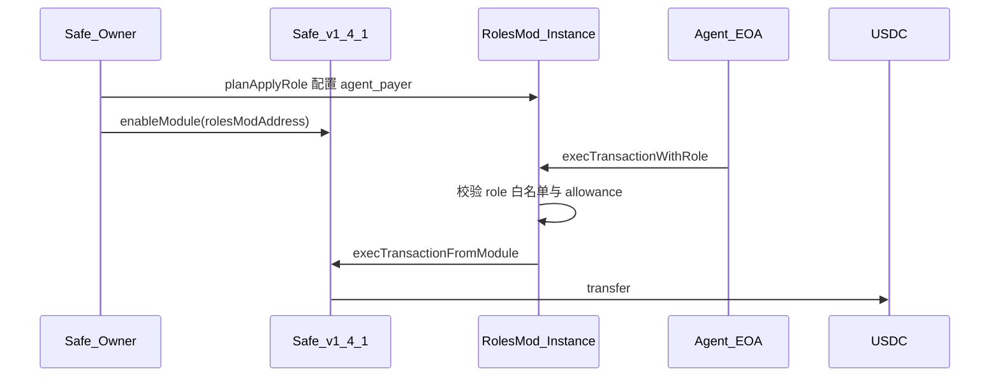

# AgentScoope Wallet｜Agent 受限执行钱包实验

> 目标：用最小可验证实验演示 AI Agent 如何在用户预先定义的链上权限边界内执行小额操作，并在越界时被明确拒绝。

## 背景

Agent Wallet 的核心不是“把主私钥交给 AI”，而是让 Agent 只能在可验证、可限制、可撤销的规则内行动。

本实验服务于 AI × Web3 School Hackathon 项目：**AgentScoope Wallet**。

## v0.3 架构（Zodiac Roles）



| 层 | 组件 | 职责 |
|----|------|------|
| 链上裁决 | **Zodiac Roles Modifier**（每 Safe 独立实例） | 成员、`transfer` 白名单、单笔/日额度 |
| 预检 / UX | **`src/policy.ts`** | `enforcement: app \| both`（默认 `both`） |
| 执行 | **`src/roles.ts`** | `execTransactionWithRole` + viem simulate |

> Safe **1.4.1** 可用，无需 `setModuleGuard`。

## 模块选型

| 项 | 说明 |
|----|------|
| 链 | Sepolia `11155111` |
| USDC | `0x1c7D4B196Cb0C7B01d743Fbc6116a902379C7238` |
| Roles 实例 | 部署后填入 `config.json` → `rolesModAddress`（**非** `0x9646…` 工厂） |
| 角色 | `roleKey`: `agent_payer` |

## 安全边界

- 主网 / 真实资金 / owner 私钥给 Agent — **禁止**
- 无限 `approve`、任意合约任意方法 — **禁止**（未写入 `roles/agent_payer/permissions.ts`）
- 越界不交给 LLM 二次确认 — `onViolation: reject`

## 快速开始

```bash
cd experiments/agent-wallet
npm install
cp .env.example .env
cp config.example.json config.json
```

链上步骤：**[SETUP.md](./SETUP.md)**（Roles 部署、`enableModule`、`roles:plan`）。

```bash
npm run roles:setup
npm run roles:plan        # Owner 执行输出的 calldata
npm run demo:success
npm run demo:roles-only   # 链上白名单拒绝（跳过 app 预检）
```

### policy.enforcement

| 值 | 白名单 / 额度预检 |
|----|-------------------|
| `both`（默认） | 应用层 + 链上 Roles |
| `app` | 仅应用层（链上仍由 Roles 裁决） |

## Demo 路径

| # | 命令 | 预期 | `rejectLayer` |
|---|------|------|---------------|
| 1 | `demo:success` | `executed` | — |
| 2 | `demo:over-limit` | `exceeds_allowance` | `zodiac_roles` |
| 3 | `demo:not-whitelisted` | `transfer_to_unlisted_address` | `app_policy`（`both`） |
| 4 | `demo:roles-only` | `transfer_to_unlisted_address` | `zodiac_roles` |
| 5 | `demo:after-revoke` | `role_revoked` | `zodiac_roles` |

## Demo 记录（Sepolia）

### 链上身份（v0.3）

| 角色 | 地址 |
|------|------|
| Safe | `0x6896DDd6E05bA19d3f2697Ebb231A60d6d2F23b7` |
| Agent | `0x6Ab1a68c4a6Ba2384050Ed1411d9B91C30EC902E` |
| Roles 实例 | `0x37C7b7437B6Bd27A15b330e6585940DEE03d2667` |
| USDC | `0x1c7D4B196Cb0C7B01d743Fbc6116a902379C7238` |

### 角色配置（`npm run roles:apply`）

| 步骤 | 交易 | Etherscan |
|------|------|-----------|
| Call 1 — `scopeFunction`（USDC `transfer` 权限） | `0xe4a8bc3354d7bd6de2f339450dfa78dd53aeb95a1180aad9b7118589cbbd4448` | [查看](https://sepolia.etherscan.io/tx/0xe4a8bc3354d7bd6de2f339450dfa78dd53aeb95a1180aad9b7118589cbbd4448) |
| Call 2 — 权限补丁（plan 剩余 diff） | `0x098b4f3c49797eed7d3525cc0f94e3ba14c0fb7ab7a9ddebaf4a0695e5d20460` | [查看](https://sepolia.etherscan.io/tx/0x098b4f3c49797eed7d3525cc0f94e3ba14c0fb7ab7a9ddebaf4a0695e5d20460) |

> `assignRoles`（Agent 加入 `agent_payer`）已在更早步骤完成；后续 `roles:apply` 仅恢复成员（见下）。

### 撤销 / 恢复（`demo:after-revoke` 前置）

| 步骤 | 交易 |
|------|------|
| `npm run roles:revoke` | [0xfb587c…](https://sepolia.etherscan.io/tx/0xfb587c9b4cfb54adb5534aaf1954de0b72e6bfd7e34f0d3cf45d23ed0c69a14c) |
| `npm run roles:apply`（恢复成员） | [0xa3e7d4…](https://sepolia.etherscan.io/tx/0xa3e7d41e341f2959376bace3b5d720e785693dbda8822153f401200867399cab) |

### Demo 执行（v0.3，2026-05-23）

| 场景 | 决策 | `reason` | `rejectLayer` | 链上 tx |
|------|------|----------|---------------|---------|
| `demo:success` | executed | — | — | [0x70583881…](https://sepolia.etherscan.io/tx/0x70583881b975348b89609459dba6e2ab7c5c21a59c647291a541cc36646914b5) |
| `demo:over-limit` | rejected（simulate） | `exceeds_allowance` | `zodiac_roles` | — |
| `demo:not-whitelisted` | rejected（simulate） | `transfer_to_unlisted_address` | `app_policy` | — |
| `demo:roles-only` | rejected（simulate） | `transfer_to_unlisted_address` | `zodiac_roles` | — |
| `demo:after-revoke` | rejected（simulate） | `role_revoked` | `zodiac_roles` | — |

> 误跑：未先 `roles:revoke` 时曾 executed → [0x1469cea…](https://sepolia.etherscan.io/tx/0x1469cea977846893376ad3a1cd88ad27ad2bc5b5cbd6035408954a9c2910ef79)（勿作 PoW）。

### WCB 审计摘录

可提交的 JSONL（五条 demo + 字段对齐）：[`logs/pow-audit-v0.3.jsonl`](./logs/pow-audit-v0.3.jsonl)

| 场景 | 决策 | `reason` | `rejectLayer` |
|------|------|----------|---------------|
| demo_success | executed | — | — |
| demo_over_limit | rejected | exceeds_allowance | zodiac_roles |
| demo_not_whitelisted | rejected | transfer_to_unlisted_address | app_policy |
| demo_roles_only | rejected | transfer_to_unlisted_address | zodiac_roles |
| demo_after_revoke | rejected | role_revoked | zodiac_roles |

样例字段见 [`logs/sample.jsonl`](./logs/sample.jsonl)。完整本地日志：`logs/audit.jsonl`（gitignore）。

### 历史（v0.1 Allowance）

| 场景 | 交易 |
|------|------|
| demo_success | [0x39575a02…](https://sepolia.etherscan.io/tx/0x39575a02d0bef794476ef53c60b39bce08ebd5127c3fb8717db2b5ad6950b961) |

## 目录结构

```text
experiments/agent-wallet/
  eth-sdk/              # USDC ABI + allow kit
  roles/agent_payer/    # members + permissions
  contracts/            # Module Guard（Safe 1.5+ 备选，见 SETUP 附录 B）
  src/roles.ts          # execTransactionWithRole
  src/allowance.ts      # 旧路径，保留参考
  logs/
  SETUP.md
```

## 后续

- Hermes / Tool Calling 编排 `npm run pay`
- 多 token / 多方法扩展 `roles/agent_payer/permissions.ts`

## 隐私提醒

勿提交私钥、助记词、 API Key。`config.json` / `audit.jsonl` 已 gitignore。
