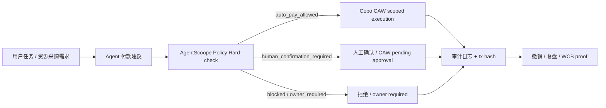

# Hackathon Brief｜AgentScoope Wallet（Cobo 赛道版）

> 切入点：[Agent Wallet（智能体钱包）](https://aiweb3.school/zh/handbook/bridge/agent-wallet/)  
> 学员：Quinn · AI 有基础 · Web3 熟悉 · 能独立开发 · 每日约 1 小时  
> 状态：v0.4 Safe / Zodiac Roles 已跑通；Week 4 主线切到 Cobo CAW 最小接入 · 2026-06-01

## 一句话

AgentScoope Wallet 是一个面向 AI Agent 的受限执行钱包：让 Agent 可以通过 **Cobo Agentic Wallet（CAW）** 在用户预设的预算、白名单、时间窗口和策略边界内完成小额支付 / 资源采购；超出边界的操作会被拒绝或进入人工确认，并留下完整审计记录。

## Hackathon / Cobo 赛道定位

**主赛道**：Cobo 赛道｜Agentic Economy × Cobo Agentic Wallet  
**主方向**：01｜Agent-Native Payments  
**Demo 场景**：03｜Agent Resource Procurement（Agent 在预算和白名单内购买 API / 数据 / 工具服务）  
**后续扩展**：02｜Trustless Agent Work Agreements（bounty payout / escrow / evaluator-based settlement）

本项目不把钱包当成附属展示组件，而是把 **Cobo CAW 放在资金执行层**：

```text
User task / bounty / resource need
  -> Agent payout or purchase recommendation
  -> AgentScoope policy hard-check
  -> Cobo Agentic Wallet scoped execution / pending approval / structured denial
  -> audit log + tx hash or denial reason
```

一句话原则：

> Agent recommends. Policy decides. Cobo executes only if allowed.  
> Agent 负责建议，Policy 负责裁决，Cobo 只执行被允许的付款。

## 为什么要做这个

Handbook 把 Agent Wallet 的核心压成一句：**控制权不能交给概率系统**。很多 Demo 卡在两个极端：

- 只给建议、不能执行 → 看起来智能，但停在「生成方案」
- 权限过大 → 用户不敢把真实资产交进去

本项目走中间路线：用 **Session Key + Policy + Guard + Simulation + Revocation + Human Check** 把「有限授权、自动执行、随时撤销、可追踪」串成一条可演示、可开源的链路。

## 用户问题

| 角色 | 痛点 |
|------|------|
| 使用 AI Agent 的 Builder | 希望 Agent 能代付 API / 工具费、提交低风险链上步骤，但不敢给主私钥或无限 `approve` |
| 自己 | 已有钱包与合约经验，缺的是把 **Agent 规划层** 和 **可验证权限层** 拆清楚、做成可复用的 Hackathon MVP |

## 解决方案概述

**AgentScoope Wallet**（工作名）：基于 **Cobo Agentic Wallet + 本地硬策略检查 + Safe / Zodiac Roles fallback** 的「Agent 受限支付 / 资源采购」参考实现。

- **Agent 层**：理解用户目标 → 输出结构化付款 / 采购建议；建议本身不授权付款
- **Policy 层**：硬检查 recipient、token、chain、amount、daily budget、human-confirm threshold、owner threshold
- **Cobo 执行层**：CAW / Pact 在授权范围内执行付款、进入 pending approval，或返回结构化拒绝
- **Fallback 层**：若 CAW 接入来不及，用现有 Sepolia Safe + Zodiac Roles + viem simulation 证明同一安全边界
- **审计层**：每次动作记录 recommendation、policy decision、CAW / fallback result、tx hash 或 denial reason



## 四要素（课程框架）

| 维度 | 内容 |
|------|------|
| **用户问题** | Agent 需要购买 API / 数据 / 工具服务或执行小额付款，但用户不能也不应交出主私钥与无限授权 |
| **Agent 能力** | 读上下文、生成结构化付款建议、调用「受限支付/采购」工具、输出人类可读执行摘要 |
| **Web3 组件** | Cobo Agentic Wallet / Pact；AgentScoope policy hard-check；Sepolia Safe + Zodiac Roles fallback；viem simulation；audit log |
| **可验证 proof** | CAW 执行 / pending / denial 记录；测试网 tx 哈希；公开 repo 日志；演示「额度内成功 / 超限拒绝 / 非白名单拒绝 / 撤销后失效」 |

## MVP 范围（Hackathon 可交付）

对齐 Cobo 赛道的 Agentic Commerce 要求：**Agent-Native Payments + Agent Resource Procurement**。

### 场景

用户让 Research / Builder Agent 购买一个白名单 API / 数据 / 工具服务。Agent 只能在 **24 小时内、最多 5 USDC（测试网代币）**、仅向 **白名单服务商地址/合约** 支付；超额、非白名单或高风险动作必须被拒绝或进入人工确认。

### 必须实现或清晰演示

1. **Agent 建议**：Agent 输出结构化付款 / 采购建议，包含 amount、token、recipient、reason、risk level
2. **硬策略检查**：Policy 层检查白名单、金额、token、链、日预算、余额、人工确认阈值、owner 阈值
3. **CAW 执行**：额度内的支付通过 Cobo Agentic Wallet / Pact 执行；若 CAW 接入受阻，用 Safe + Zodiac Roles fallback 演示同一约束
4. **人工确认**：中风险动作进入 human confirmation / pending approval；高风险或 owner threshold 不能被普通确认绕过
5. **拒绝路径**：10 USDC、非白名单地址、错误 token / chain → Policy 拦截（有明确错误原因）
6. **撤销**：用户撤销 Pact / session / role；撤销后 Agent 无法再执行
7. **审计**：每笔操作写入 `experiments/agent-wallet/logs/`，记录 recommendation id、policy decision、tx hash 或 denial reason

### 明确不做（v0.1）

- 主网与真实资金
- Agent 持有助记词 / 主私钥
- 无限 `approve`、任意合约任意方法
- 全自动大额转账、NFT 转出、合约升级
- 自主交易策略、套利、做市、收益管理（Autonomous Trading 方向暂不做）
- 多 Agent 互雇 / 拍卖 / 分账 / Treasury 管理（A2A Economy 放入 roadmap）

## 已确认决策

| 项 | 决定 |
|----|------|
| 工作名 | **AgentScoope Wallet** |
| 目标链 | **Sepolia** |
| 实现路径 | **Cobo CAW 最小接入 + Safe / Zodiac Roles fallback**，优先快速出可演示 MVP |
| Agent 运行时 | **Hermes** + `npm run tool` JSON CLI（v0.4） |

## 技术选型（已定）

| 层 | 选择 | 说明 |
|----|------|------|
| 链 | **Sepolia** | 测试币、faucet、区块浏览器齐全 |
| 主执行层 | **Cobo Agentic Wallet / Pact** | Week 4 目标：至少跑通 allowed transfer、pending approval 或 structured denial 中的 1–2 条 |
| Fallback 账户 | **Safe（1-of-1 或 2-of-2 测试多签）** | 已有 Sepolia Safe / Zodiac Roles demo，可证明安全边界 |
| 权限模块 | **Zodiac Roles Modifier / CAW Pact** | 表达额度、白名单、方法、有效期 |
| 策略 / 拦截 | AgentScoope policy hard-check + CAW / Roles 约束 | 越界交易在调用钱包执行前被拒绝；链上层再二次约束 |
| 模拟 | **viem** `simulateContract` / `simulateCalls` | 广播前输出可读摘要 |
| Agent 运行时 | Hermes + `npm run tool` JSON CLI | 仅编排，不持有 owner 私钥 |
| 工程 | CAW SDK / CLI + viem scripts + audit log | Foundry 仅在有自定义 adapter 需求时再用 |

## Cobo CAW 最小接入计划（Week 4 主路径）

> 目标：让 Cobo CAW 成为 AgentScoope 的资金执行层，而不是只作为参考资料出现。

### 推荐最小 demo loop

1. 安装并运行 Cobo Agentic Wallet SDK / CLI（如有邀请码 / API 权限）。
2. 本地配置 `AGENT_WALLET_API_URL`、`AGENT_WALLET_API_KEY`、`AGENT_WALLET_WALLET_ID`（只放本机 `.env`，不提交）。
3. 创建或模拟一个 Pact：限制 24h / 5 USDC / 白名单服务商 / 指定 token / 指定链。
4. Agent 输出一条付款 / 资源采购建议，例如“向白名单 API 服务商支付 0.5 USDC”。
5. AgentScoope policy hard-check 输出四类结果之一：
   - `auto_pay_allowed`
   - `human_confirmation_required`
   - `blocked`
   - `owner_required`
6. 只有 `auto_pay_allowed` / 用户确认后的 `human_confirmation_required` 才进入 CAW 执行。
7. 记录 CAW 执行结果、pending approval、structured denial，或 fallback tx hash / denial reason。

### CAW 接入 fallback 原则

如果 CAW SDK / API 权限、邀请码或测试环境在提交前无法完全打通，项目不改方向，只降级执行层：

- **主叙事仍然是 Cobo CAW scoped execution**；
- 用现有 **Safe + Zodiac Roles** 证明同样的 policy / whitelist / spending limit / revoke 边界；
- README 中明确标注：CAW 是目标执行层，Safe / Zodiac Roles 是 fallback implementation；
- 不把 fallback 包装成已完成的 CAW 集成。

## Safe + 现成模块：Fallback 实施步骤（已跑通）

> 目标：用最少自定义合约，在 Sepolia 上演示「有限授权 → 自动执行 → 可撤销」。

### 推荐模块组合（按易用度）

1. **首选调研**：Safe 生态里的 **Allowance / Spending Limit** 类模块，或 **Zodiac Roles Modifier**（角色 + 目标合约 + 方法白名单）。
2. **Agent 身份**：单独一个 **Agent EOA**（仅测试网），由模块授权为 delegate / role holder，**不是** Safe owner。
3. **撤销**：在 Safe UI 或链上调用 `disableModule` / 移除 role / 清零 allowance — 演示「撤销后 Agent 无法再花」。

### 分步清单

| 步骤 | 动作 | 产出 |
|------|------|------|
| 1 | Sepolia 创建 Safe，存入测试 ETH + 测试 USDC | Safe 地址写入 `experiments/agent-wallet/config.json` |
| 2 | 调研并启用一个现成 Module（记录模块名、版本、部署地址） | README「模块选型」小节 |
| 3 | 配置：24h / 5 USDC / 白名单收款方或合约 | 链上配置 tx 哈希 |
| 4 | 用 Agent EOA 在额度内发起一笔 `pay` | 成功 tx + 审计日志 |
| 5 | 尝试 6 USDC 或 非白名单地址 | 被拒绝的 tx 或 simulation 报错 |
| 6 | Owner 撤销模块或 delegate | 再执行失败，原因明确 |

### 架构（Safe 路径）

```text
用户（Safe Owner）── 配置 Module（额度 / 白名单 / 有效期）
        │
        ▼
   Safe 账户（Sepolia）── 持有测试 USDC
        │
        ├── Module：仅允许 Agent EOA 在规则内 execTransactionFromModule
        ├── Guard（可选）：二次校验 calldata / 目标地址
        └── Agent：生成 calldata → viem simulate → 模块执行（无 owner 私钥）
```

## Policy 示例（v0.1）

```yaml
# 示意：最终落地为代码可解析结构，而非仅文档
session:
  expires_at: "+24h"
  spend:
    token: USDC
    max_per_tx: "1"
    max_daily: "5"
  allow:
    contracts: ["0x...apiTreasury", "0x...toolRegistry"]
    methods: ["pay", "subscribe"]
  deny:
    - approve_unlimited
    - transfer_to_eoa
    - setApprovalForAll
  on_violation: reject  # 不降级为「询问用户是否继续」
```

## Human Check 分层

| 级别 | 条件 | 行为 |
|------|------|------|
| L0 自动 | 在白名单、未超额、simulation 与意图一致 | Session Key 执行 |
| L1 确认 | 中等风险、可逆、需改授权参数 | 展示 simulation → 用户确认 |
| L2 强制 | 大额、不可逆、对外可见状态变更 | 必须主账户/多签确认 |
| L3 拒绝 | 违反 Policy | Guard 拒绝，记录原因 |

## 里程碑（按每天约 1 小时）

| 周次 | 目标 | 产出 |
|------|------|------|
| W1 D1–D2 | 定 brief、画架构、建 `experiments/agent-wallet/` | 本文件 + 流程图 + 空目录 README |
| W1 D3–D4 | Sepolia 创建 Safe + 启用现成 Module + 第一笔额度内支付 | Safe 地址、模块名、tx 哈希 |
| W1 D5–D7 | 配置白名单 / 日限额 + 「超额拒绝」演示 | 日志 + simulation 输出 |
| W2 | 撤销 delegate / disable module + 非白名单拦截 | 四条对比演示（见下） |
| W2+ | Agent 工具：plan → simulate → execute/reject | 端到端 demo + WCB evidence |

### 四条必拍对比演示

1. **正常**：额度内自动支付 + 审计记录  
2. **超限**：请求 6 USDC → Policy 拒绝  
3. **异常**：非白名单地址 → Guard 拒绝  
4. **撤销**：用户撤销 session → 后续 Agent 调用失败且原因明确  

## Proof-of-Work 清单

提交 Hackathon / WCB 任务时可用的公开材料：

- [x] 本 brief 与架构图（本仓库 `hackathon/`）
- [x] `experiments/agent-wallet/` 代码与 README
- [x] 测试网合约地址 + Session 配置说明（**不含**私钥/助记词）
- [x] ≥4 笔代表性交易的区块浏览器链接
- [x] 审计日志样例（JSONL 或 markdown 表）
- [x] 1 页「Agent 不能做什么」边界说明 — 见 README § 安全边界

**Week 1 Pack 总入口**：[`submissions/week1-pow-pack.md`](../submissions/week1-pow-pack.md)

## WCB Agent API 对齐

本地通过 `.env` 加载 `WCB_AGENT_SECRET_API_KEY`（**勿提交到 git**，已在 `.gitignore`）。

```bash
# 在仓库根目录
set -a && source .env && set +a

# 示例：读取学员今日活动（programId 来自 WCB Learning 页面）
curl -sS -X POST "https://web3career.build/api/agent/call" \
  -H "Authorization: Bearer $WCB_AGENT_SECRET_API_KEY" \
  -H "Content-Type: application/json" \
  -d '{
    "procedure": "events.listForLearner",
    "input": {
      "programId": "cmnx791nl008sru0167pzp4ki",
      "rangeStart": "2026-05-18T00:00:00.000Z",
      "rangeEnd": "2026-05-19T00:00:00.000Z"
    }
  }'
```

常用 procedure（见 [WCB Agent API](https://web3career.build/llms.txt)）：

| 用途 | procedure |
|------|-----------|
| 个人资料 | `users.getProfile` |
| 学员任务 | `tasks.listForLearner` |
| 会议/活动 | `events.listForLearner` |
| 提交 PoW | `tasks.submitEvidence`（**写入前须你确认**） |

**2026-05-18 API 探测**：`users.getProfile` 正常；今日 `events.listForLearner` 返回 2 场活动（与 daily note 一致）。任务列表当前为空，可能需在 WCB 页面确认 track / 报名状态后再查。

## 与课程模块的映射

| 课程模块 | 本项目如何覆盖 |
|----------|----------------|
| Week 1 模块 B 钱包/签名 | 测试网钱包、simulation、浏览器验证 |
| Week 1 模块 C 交叉实验 | AI 生成计划 → 人工复核 → 受限执行 → 验证记录 |
| Handbook Agent Wallet | Session Key、Policy、Guard、Revocation、Human Check |
| Week 2 支付/身份/权限（预告） | 为后续支付与身份场景预留扩展点 |

## 风险与原则

1. **Agent 不碰主私钥**；Session Key 仅最小权限、可撤销。  
2. **越界即拒绝**，不用「用户再点一次确认」绕过 Policy。  
3. **Agent 输出建议不等于授权**；`execution_allowed = true` 只能来自 policy hard-check。  
4. **Cobo / Safe 只执行被允许的付款**，钱包执行层不直接信任 LLM 自由文本。  
5. **公开 repo** 不写 API key、助记词、内部会议链接、CAW API credentials。  
6. **WCB / Hackathon 写入型操作**由 Agent 起草、**你确认后再提交**。

## 开放问题

1. **正式 Hackathon 题目/截止时间** — 需在 WCB Learning 登录后确认。  
2. ~~**具体用哪个 Safe 模块**~~ — **已决（v0.3）**：**Zodiac Roles Modifier** 完全替代 Allowance；链上白名单 + 单笔/日额度；`execTransactionWithRole`。Safe 1.4.1 可用。Allowance / Module Guard 移入 SETUP 附录。  
3. ~~**Agent 运行时**~~ — **已决（v0.4）**：**Hermes Skill** + [`experiments/agent-wallet/src/tools/`](../experiments/agent-wallet/src/tools/) → `runPay()`。

## v0.3 已完成（Zodiac Roles）

- 执行：`experiments/agent-wallet/src/roles.ts`（`rejectLayer: zodiac_roles`）  
- 权限：`roles/agent_payer/` + `npm run roles:plan`  
- 配置：`executionPath: zodiac_roles`，`rolesModAddress`，`roleKey`  
- Demo：`demo:roles-only` 证明链上白名单；`demo:after-revoke` → `role_revoked`  
- 文档：`experiments/agent-wallet/SETUP.md`（主路径）、README  

## Proof-of-Work 补充（Roles）

- [x] Roles 实例：`0x37C7b7437B6Bd27A15b330e6585940DEE03d2667`（Safe `0x6896…`）  
- [x] Owner apply（`npm run roles:apply`）：[Call 1](https://sepolia.etherscan.io/tx/0xe4a8bc3354d7bd6de2f339450dfa78dd53aeb95a1180aad9b7118589cbbd4448) · [Call 2](https://sepolia.etherscan.io/tx/0x098b4f3c49797eed7d3525cc0f94e3ba14c0fb7ab7a9ddebaf4a0695e5d20460)  
- [x] `demo:success`：[0x70583881…](https://sepolia.etherscan.io/tx/0x70583881b975348b89609459dba6e2ab7c5c21a59c647291a541cc36646914b5)  
- [x] `demo:over-limit` / `demo:roles-only`：审计见 [`logs/pow-audit-v0.3.jsonl`](../experiments/agent-wallet/logs/pow-audit-v0.3.jsonl)（simulate，`zodiac_roles`）  
- [x] `demo:not-whitelisted`：`app_policy`（同上 JSONL）  
- [x] `demo:after-revoke`：`roles:revoke` [0xfb587c…](https://sepolia.etherscan.io/tx/0xfb587c9b4cfb54adb5534aaf1954de0b72e6bfd7e34f0d3cf45d23ed0c69a14c) → simulate `role_revoked` / `NoMembership()`；恢复 [0xa3e7d4…](https://sepolia.etherscan.io/tx/0xa3e7d41e341f2959376bace3b5d720e785693dbda8822153f401200867399cab)

详见 `experiments/agent-wallet/README.md` § Demo 记录；审计 [`logs/pow-audit-v0.3.jsonl`](../experiments/agent-wallet/logs/pow-audit-v0.3.jsonl)（五条齐全）。

## v0.4 已完成（Hermes + Tools）

- Tools：`npm run tool -- get-policy | get-spending-status | simulate | pay`
- Human Check：L0 / L1 `--confirm` / L2 `requires_owner_signature`
- 24h 日累计：`src/daily-budget.ts` → `exceeds_daily_budget`
- Hermes：[`hermes/SKILL.md`](../experiments/agent-wallet/hermes/SKILL.md)、[`HERMES.md`](../experiments/agent-wallet/HERMES.md)
- Demo：`npm run demo:e2e`、v0.4 三条新 demo

## 下一步（建议）

1. 把 README / Demo script 改成 Cobo 赛道语言：Agent-Native Payments + Resource Procurement。
2. 尝试 CAW SDK / CLI 最小接入：allowed transfer、pending approval、structured denial 至少跑通 1–2 条。
3. 如果 CAW 接入受阻，保留 Safe + Zodiac Roles fallback，但在提交材料里透明说明。
4. 录制 3–5 分钟 Demo：额度内成功、超额拒绝、非白名单拒绝、撤销后失败。
5. v0.5：多 token / 链上日累计 allowance / bounty payout 场景。

---

**相关链接**

- Handbook：[Agent Wallet](https://aiweb3.school/zh/handbook/bridge/agent-wallet/)
- 关联章节：[Agent Workflow](https://aiweb3.school/zh/handbook/bridge/agent-workflow/) · [AI Security](https://aiweb3.school/zh/handbook/bridge/ai-security/)
- WCB Learning：https://web3career.build/zh/programs/AI-Web3-School#tab=learning
- 学习仓库：https://github.com/baikingrio/ai-web3-school-note
