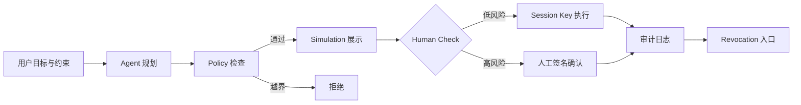

# Hackathon Brief｜AgentScoope Wallet（钱包与权限）

> 切入点：[Agent Wallet（智能体钱包）](https://aiweb3.school/zh/handbook/bridge/agent-wallet/)  
> 学员：Quinn · AI 有基础 · Web3 熟悉 · 能独立开发 · 每日约 1 小时  
> 状态：已确认 v0.3 Zodiac Roles · 2026-05-20

## 一句话

让 AI Agent 只能在**用户预先写死的链上权限边界**里自动执行小额、可审计、可撤销的操作；超出边界一律由 Policy / Guard 拒绝，而不是再问用户「要不要继续」。

## 为什么要做这个

Handbook 把 Agent Wallet 的核心压成一句：**控制权不能交给概率系统**。很多 Demo 卡在两个极端：

- 只给建议、不能执行 → 看起来智能，但停在「生成方案」
- 权限过大 → 用户不敢把真实资产交进去

本项目走中间路线：用 **Session Key + Policy + Guard + Simulation + Revocation + Human Check** 把「有限授权、自动执行、随时撤销、可追踪」串成一条可演示、可开源的链路。

## 用户问题

| 角色 | 痛点 |
|------|------|
| 使用 AI Agent 的 Builder | 希望 Agent 能代付 API / 工具费、提交低风险链上步骤，但不敢给主私钥或无限 `approve` |
| 自己 | 已有钱包与合约经验，缺的是把 **Agent 规划层** 和 **可验证权限层** 拆清楚、做成可复用的 Hackathon MVP |

## 解决方案概述

**AgentScoope Wallet**（工作名）：基于 **Sepolia + Safe + 现成模块** 的「Agent 受限执行」参考实现。

- **Agent 层**：理解用户目标 → 生成交易/操作计划（不持有主私钥）
- **权限层**：Sepolia 上的 Safe 账户 + 现成 Module（限额 / 角色 / 白名单）表达时间、额度、可调目标
- **安全层**：模块内 policy + 可选 Safe Guard + Simulation 可读摘要
- **人机层**：分层 Human Check（自动 / 模拟后确认 / 强制人工 / 直接拒绝）
- **审计层**：每次动作留下结构化日志，供 repo 与 WCB 任务提交



## 四要素（课程框架）

| 维度 | 内容 |
|------|------|
| **用户问题** | Agent 需要代付/代执行，但用户不能也不应交出主私钥与无限授权 |
| **Agent 能力** | 读上下文、生成计划、调用「受限支付/调用」工具、输出人类可读 simulation 摘要 |
| **Web3 组件** | Sepolia Safe；现成 Spending Limit / Roles 类模块；Policy；可选 Guard；viem simulation；撤销 = 停用模块或移除 delegate |
| **可验证 proof** | 公开 repo 日志 + 测试网 tx 哈希 + 区块浏览器 + 演示「额度内成功 / 超限拒绝 / 撤销后失效」 |

## MVP 范围（Hackathon 可交付）

对齐 Handbook [最小实践](https://aiweb3.school/zh/handbook/bridge/agent-wallet/)：**Agent 受限支付钱包**。

### 场景

用户授权 Agent：在 **24 小时内、最多 5 USDC（测试网代币）**、仅向 **白名单地址/合约** 支付指定 API 或工具费用。

### 必须实现或清晰演示

1. **授权表达**：额度、时间、目标地址/合约、可调方法（写入配置或链上 policy）
2. **自动执行**：额度内的支付由 Session Key（或等效受限签名者）自动完成
3. **人工确认**：修改授权、超额、非白名单转出 → 必须人工确认或直接拒绝
4. **Simulation**：广播前展示「付多少 / 改哪些授权 / 调哪个合约」
5. **拒绝路径**：6 USDC、非白名单地址 → Policy 或 Guard 拦截（有明确错误原因）
6. **撤销**：用户一键撤销 session / 权限；撤销后 Agent 无法再执行
7. **审计**：每笔操作写入 `experiments/agent-wallet/logs/`（或链上事件 + repo 索引）

### 明确不做（v0.1）

- 主网与真实资金
- Agent 持有助记词 / 主私钥
- 无限 `approve`、任意合约任意方法
- 全自动大额转账、NFT 转出、合约升级

## 已确认决策

| 项 | 决定 |
|----|------|
| 工作名 | **AgentScoope Wallet** |
| 目标链 | **Sepolia** |
| 实现路径 | **Safe + 现成模块**，优先快速出可演示 MVP |
| Agent 运行时 | 待定（Learning Agent 编排 / Hermes / 自建 tool loop） |

## 技术选型（已定）

| 层 | 选择 | 说明 |
|----|------|------|
| 链 | **Sepolia** | 测试币、faucet、区块浏览器齐全 |
| 账户 | **Safe（1-of-1 或 2-of-2 测试多签）** | [app.safe.global](https://app.safe.global/) 创建 Sepolia Safe |
| 权限模块 | **现成 Safe Module**（见下节） | 不自研 AA 账户；用模块表达额度与白名单 |
| 策略 / 拦截 | 模块内置规则 + 可选 **Safe Guard** | 越界交易在模块或 Guard 层拒绝 |
| 模拟 | **viem** `simulateContract` / `simulateCalls` | 先本地可读摘要，必要时再加 Tenderly |
| Agent 运行时 | Learning Agent + 工具调用（暂定） | 仅编排，不持有 Safe owner 私钥 |
| 工程 | **viem** 脚本 + Safe Transaction Service API | Foundry 仅在有自定义 adapter 需求时再用 |

## Safe + 现成模块：实施步骤（MVP）

> 目标：用最少自定义合约，在 Sepolia 上演示「有限授权 → 自动执行 → 可撤销」。

### 推荐模块组合（按易用度）

1. **首选调研**：Safe 生态里的 **Allowance / Spending Limit** 类模块，或 **Zodiac Roles Modifier**（角色 + 目标合约 + 方法白名单）。
2. **Agent 身份**：单独一个 **Agent EOA**（仅测试网），由模块授权为 delegate / role holder，**不是** Safe owner。
3. **撤销**：在 Safe UI 或链上调用 `disableModule` / 移除 role / 清零 allowance — 演示「撤销后 Agent 无法再花」。

### 分步清单

| 步骤 | 动作 | 产出 |
|------|------|------|
| 1 | Sepolia 创建 Safe，存入测试 ETH + 测试 USDC | Safe 地址写入 `experiments/agent-wallet/config.json` |
| 2 | 调研并启用一个现成 Module（记录模块名、版本、部署地址） | README「模块选型」小节 |
| 3 | 配置：24h / 5 USDC / 白名单收款方或合约 | 链上配置 tx 哈希 |
| 4 | 用 Agent EOA 在额度内发起一笔 `pay` | 成功 tx + 审计日志 |
| 5 | 尝试 6 USDC 或 非白名单地址 | 被拒绝的 tx 或 simulation 报错 |
| 6 | Owner 撤销模块或 delegate | 再执行失败，原因明确 |

### 架构（Safe 路径）

```text
用户（Safe Owner）── 配置 Module（额度 / 白名单 / 有效期）
        │
        ▼
   Safe 账户（Sepolia）── 持有测试 USDC
        │
        ├── Module：仅允许 Agent EOA 在规则内 execTransactionFromModule
        ├── Guard（可选）：二次校验 calldata / 目标地址
        └── Agent：生成 calldata → viem simulate → 模块执行（无 owner 私钥）
```

## Policy 示例（v0.1）

```yaml
# 示意：最终落地为代码可解析结构，而非仅文档
session:
  expires_at: "+24h"
  spend:
    token: USDC
    max_per_tx: "1"
    max_daily: "5"
  allow:
    contracts: ["0x...apiTreasury", "0x...toolRegistry"]
    methods: ["pay", "subscribe"]
  deny:
    - approve_unlimited
    - transfer_to_eoa
    - setApprovalForAll
  on_violation: reject  # 不降级为「询问用户是否继续」
```

## Human Check 分层

| 级别 | 条件 | 行为 |
|------|------|------|
| L0 自动 | 在白名单、未超额、simulation 与意图一致 | Session Key 执行 |
| L1 确认 | 中等风险、可逆、需改授权参数 | 展示 simulation → 用户确认 |
| L2 强制 | 大额、不可逆、对外可见状态变更 | 必须主账户/多签确认 |
| L3 拒绝 | 违反 Policy | Guard 拒绝，记录原因 |

## 里程碑（按每天约 1 小时）

| 周次 | 目标 | 产出 |
|------|------|------|
| W1 D1–D2 | 定 brief、画架构、建 `experiments/agent-wallet/` | 本文件 + 流程图 + 空目录 README |
| W1 D3–D4 | Sepolia 创建 Safe + 启用现成 Module + 第一笔额度内支付 | Safe 地址、模块名、tx 哈希 |
| W1 D5–D7 | 配置白名单 / 日限额 + 「超额拒绝」演示 | 日志 + simulation 输出 |
| W2 | 撤销 delegate / disable module + 非白名单拦截 | 四条对比演示（见下） |
| W2+ | Agent 工具：plan → simulate → execute/reject | 端到端 demo + WCB evidence |

### 四条必拍对比演示

1. **正常**：额度内自动支付 + 审计记录  
2. **超限**：请求 6 USDC → Policy 拒绝  
3. **异常**：非白名单地址 → Guard 拒绝  
4. **撤销**：用户撤销 session → 后续 Agent 调用失败且原因明确  

## Proof-of-Work 清单

提交 Hackathon / WCB 任务时可用的公开材料：

- [x] 本 brief 与架构图（本仓库 `hackathon/`）
- [x] `experiments/agent-wallet/` 代码与 README
- [x] 测试网合约地址 + Session 配置说明（**不含**私钥/助记词）
- [x] ≥4 笔代表性交易的区块浏览器链接
- [x] 审计日志样例（JSONL 或 markdown 表）
- [x] 1 页「Agent 不能做什么」边界说明 — 见 README § 安全边界

**Week 1 Pack 总入口**：[`submissions/week1-pow-pack.md`](../submissions/week1-pow-pack.md)

## WCB Agent API 对齐

本地通过 `.env` 加载 `WCB_AGENT_SECRET_API_KEY`（**勿提交到 git**，已在 `.gitignore`）。

```bash
# 在仓库根目录
set -a && source .env && set +a

# 示例：读取学员今日活动（programId 来自 WCB Learning 页面）
curl -sS -X POST "https://web3career.build/api/agent/call" \
  -H "Authorization: Bearer $WCB_AGENT_SECRET_API_KEY" \
  -H "Content-Type: application/json" \
  -d '{
    "procedure": "events.listForLearner",
    "input": {
      "programId": "cmnx791nl008sru0167pzp4ki",
      "rangeStart": "2026-05-18T00:00:00.000Z",
      "rangeEnd": "2026-05-19T00:00:00.000Z"
    }
  }'
```

常用 procedure（见 [WCB Agent API](https://web3career.build/llms.txt)）：

| 用途 | procedure |
|------|-----------|
| 个人资料 | `users.getProfile` |
| 学员任务 | `tasks.listForLearner` |
| 会议/活动 | `events.listForLearner` |
| 提交 PoW | `tasks.submitEvidence`（**写入前须你确认**） |

**2026-05-18 API 探测**：`users.getProfile` 正常；今日 `events.listForLearner` 返回 2 场活动（与 daily note 一致）。任务列表当前为空，可能需在 WCB 页面确认 track / 报名状态后再查。

## 与课程模块的映射

| 课程模块 | 本项目如何覆盖 |
|----------|----------------|
| Week 1 模块 B 钱包/签名 | 测试网钱包、simulation、浏览器验证 |
| Week 1 模块 C 交叉实验 | AI 生成计划 → 人工复核 → 受限执行 → 验证记录 |
| Handbook Agent Wallet | Session Key、Policy、Guard、Revocation、Human Check |
| Week 2 支付/身份/权限（预告） | 为后续支付与身份场景预留扩展点 |

## 风险与原则

1. **Agent 不碰主私钥**；Session Key 仅最小权限、可撤销。  
2. **越界即拒绝**，不用「用户再点一次确认」绕过 Policy。  
3. **公开 repo** 不写 API key、助记词、内部会议链接。  
4. **WCB 写入型 API**（如 `tasks.submitEvidence`）由 Agent 起草、**你确认后再提交**。

## 开放问题

1. **正式 Hackathon 题目/截止时间** — 需在 WCB Learning 登录后确认。  
2. ~~**具体用哪个 Safe 模块**~~ — **已决（v0.3）**：**Zodiac Roles Modifier** 完全替代 Allowance；链上白名单 + 单笔/日额度；`execTransactionWithRole`。Safe 1.4.1 可用。Allowance / Module Guard 移入 SETUP 附录。  
3. **Agent 运行时** — Learning Agent 仅编排，还是接 Hermes / 自建 tool loop？

## v0.3 已完成（Zodiac Roles）

- 执行：`experiments/agent-wallet/src/roles.ts`（`rejectLayer: zodiac_roles`）  
- 权限：`roles/agent_payer/` + `npm run roles:plan`  
- 配置：`executionPath: zodiac_roles`，`rolesModAddress`，`roleKey`  
- Demo：`demo:roles-only` 证明链上白名单；`demo:after-revoke` → `role_revoked`  
- 文档：`experiments/agent-wallet/SETUP.md`（主路径）、README  

## Proof-of-Work 补充（Roles）

- [x] Roles 实例：`0x37C7b7437B6Bd27A15b330e6585940DEE03d2667`（Safe `0x6896…`）  
- [x] Owner apply（`npm run roles:apply`）：[Call 1](https://sepolia.etherscan.io/tx/0xe4a8bc3354d7bd6de2f339450dfa78dd53aeb95a1180aad9b7118589cbbd4448) · [Call 2](https://sepolia.etherscan.io/tx/0x098b4f3c49797eed7d3525cc0f94e3ba14c0fb7ab7a9ddebaf4a0695e5d20460)  
- [x] `demo:success`：[0x70583881…](https://sepolia.etherscan.io/tx/0x70583881b975348b89609459dba6e2ab7c5c21a59c647291a541cc36646914b5)  
- [x] `demo:over-limit` / `demo:roles-only`：审计见 [`logs/pow-audit-v0.3.jsonl`](../experiments/agent-wallet/logs/pow-audit-v0.3.jsonl)（simulate，`zodiac_roles`）  
- [x] `demo:not-whitelisted`：`app_policy`（同上 JSONL）  
- [x] `demo:after-revoke`：`roles:revoke` [0xfb587c…](https://sepolia.etherscan.io/tx/0xfb587c9b4cfb54adb5534aaf1954de0b72e6bfd7e34f0d3cf45d23ed0c69a14c) → simulate `role_revoked` / `NoMembership()`；恢复 [0xa3e7d4…](https://sepolia.etherscan.io/tx/0xa3e7d41e341f2959376bace3b5d720e785693dbda8822153f401200867399cab)

详见 `experiments/agent-wallet/README.md` § Demo 记录；审计 [`logs/pow-audit-v0.3.jsonl`](../experiments/agent-wallet/logs/pow-audit-v0.3.jsonl)（五条齐全）。

## 下一步（建议）

1. （可选）接 Hermes Tool Calling 包装 `npm run pay`。  
2. Week 1 PoW 已在 WCB 通过；后续 Pack 更新见 [`submissions/week1-pow-pack.md`](../submissions/week1-pow-pack.md)。

---

**相关链接**

- Handbook：[Agent Wallet](https://aiweb3.school/zh/handbook/bridge/agent-wallet/)
- 关联章节：[Agent Workflow](https://aiweb3.school/zh/handbook/bridge/agent-workflow/) · [AI Security](https://aiweb3.school/zh/handbook/bridge/ai-security/)
- WCB Learning：https://web3career.build/zh/programs/AI-Web3-School#tab=learning
- 学习仓库：https://github.com/baikingrio/ai-web3-school-note
