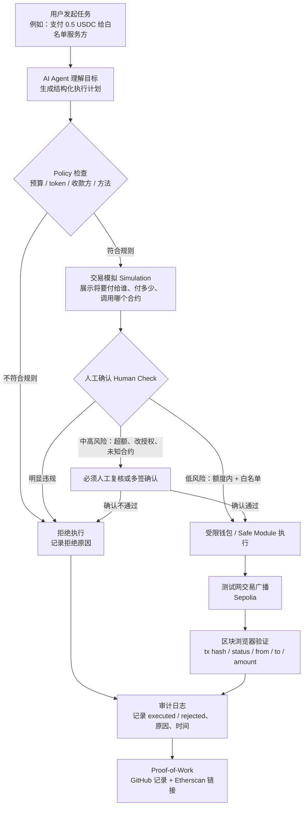

# Week 1｜AI × Web3 最小交叉流程图

## 任务说明

任务：**Week 1｜AI × Web3 综合任务｜画出 AI × Web3 最小交叉流程图**  
Task ID：`cmp3jyrc507sin301kjhy1mwf`

这个任务要求画出一个最小 AI × Web3 工作流，并标出：

1. 谁发起任务；
2. 谁执行；
3. 哪一步需要钱包签名 / 付款 / 授权；
4. 哪一步必须人工确认；
5. 如何验证结果；
6. 可能的风险点。

我选择的场景是：**用户让 AI Agent 在测试网上帮自己执行一笔小额、受限的链上支付**。

这个场景和我的 Hackathon 项目 **AgentScoope Wallet** 有关：我希望验证的不是“AI 能不能发交易”，而是“AI 能不能在明确权限边界里安全地发交易”。

---

## 一句话流程

> 用户提出支付目标 → AI Agent 生成计划 → Policy 检查预算和白名单 → 人工确认关键风险 → 钱包 / Safe 执行测试网交易 → 区块浏览器和审计日志验证结果。

---

## 最小交叉流程图



---

## 参与方说明

### 1. 谁发起任务

发起者是**用户**。

用户用自然语言提出目标，例如：

> 帮我在测试网上支付 0.5 USDC 给这个白名单服务方。

用户不应该把主私钥交给 AI，也不应该给 AI 一个无限制的钱包权限。

### 2. 谁执行

执行分成两层：

- **AI Agent**：负责理解用户目标，生成操作计划，调用工具，解释结果。
- **Web3 钱包 / Safe / 权限模块**：负责真正判断这笔交易能不能执行，并在链上执行或拒绝。

也就是说，AI Agent 不是资产的最终控制者，它只是一个受限操作者。

### 3. 哪一步需要钱包签名 / 付款 / 授权

需要钱包签名或授权的地方主要有三类：

1. **初始授权**：用户或 Safe owner 配置 Agent 可以做什么，例如 token、额度、白名单地址、有效期。
2. **交易执行**：如果交易在授权范围内，可以由受限 Agent / Module 执行。
3. **权限变更**：如果要提高额度、加入新地址、改白名单、开启新合约方法，必须由用户或多签重新确认。

在我的 AgentScoope Wallet 设想里，Agent 不能随便转账，它只能在 Safe + Roles / Policy 预设范围内操作。

### 4. 哪一步必须人工确认

我把人工确认分成四层：

- **L0 自动执行**：小额、白名单、预算内、已模拟通过。
- **L1 用户确认**：金额接近阈值，或者需要用户看一眼 simulation 摘要。
- **L2 Owner / 多签确认**：大额支付、修改额度、修改白名单、修改模块权限。
- **L3 直接拒绝**：私钥请求、无限 approve、未知合约、非白名单地址、超出预算、绕过 policy。

这样做的原因是：AI 可以生成计划，但不能替用户承担资产风险。

---

## 结果如何验证

最小验证方式包括三部分：

1. **交易哈希 / 区块浏览器**
   - 检查交易是否成功；
   - 检查链是否是测试网；
   - 检查 from / to / amount 是否符合计划；
   - 检查是否调用了预期合约或模块。

2. **本地 / 仓库审计日志**
   - 记录本次操作是 `executed` 还是 `rejected`；
   - 记录拒绝原因，例如 `exceeds_allowance`、`non_whitelisted_recipient`、`human_confirm_required`；
   - 记录对应的 tx hash 或 simulation 结果。

3. **GitHub Proof-of-Work**
   - 把流程图、说明、测试网链接和审计日志索引放到公开仓库；
   - 让审核者可以从文档跳到代码、日志和链上记录。

---

## 可能的风险点

这个最小流程里，我认为主要风险有：

1. **AI 理解错用户意图**  
   例如用户说“付一点钱”，Agent 误解金额或对象。

2. **Prompt injection / 恶意输入**  
   外部页面或工具返回内容诱导 Agent 忽略规则、改变收款方、扩大权限。

3. **钱包权限过大**  
   如果 Agent 拿到主私钥、无限 approve 或任意合约调用权限，风险会非常高。

4. **模拟结果和真实执行不一致**  
   如果只看自然语言解释，不做链上 simulation 和参数检查，用户可能不知道实际交易内容。

5. **缺少审计记录**  
   如果只留下 tx hash，不记录为什么执行、为什么拒绝、谁确认过，就很难复盘和追责。

6. **人工确认设计太粗糙**  
   如果所有操作都要求确认，体验很差；如果所有操作都自动执行，安全风险太高。

---

## 和 AgentScoope Wallet 的关系

这个流程图帮助我把 AI × Web3 的边界想清楚：

- **AI 部分**负责理解目标、生成计划、调用工具、解释结果；
- **Web3 部分**负责账户、权限、签名、链上执行和可验证记录；
- **人工确认**负责把高风险动作拦下来；
- **审计日志**负责把执行和拒绝都留下证据。

所以 AgentScoope Wallet 的核心不是“让 AI 帮我点钱包”，而是：

> 给 AI 一个可限制、可撤销、可审计的执行空间，让它只在用户定义好的边界里完成小额链上操作。

这也是我对 AI × Web3 最小交叉的理解：AI 提供意图理解和工具编排，Web3 提供权限边界和公开可验证的执行结果。

---

## 可复用的 WCB 提交证明

```text
我完成了 Week 1「AI × Web3 综合任务｜画出 AI × Web3 最小交叉流程图」。

这次我选择的场景是：用户让 AI Agent 在测试网上帮自己执行一笔小额、受限的链上支付。

我在流程图里标出了：用户如何发起任务、AI Agent 如何生成执行计划、Policy 如何检查预算 / token / 收款方 / 方法、哪些步骤需要钱包授权或交易执行、哪些情况必须人工确认，以及最后如何通过 Sepolia 区块浏览器、审计日志和 GitHub 记录验证结果。

这个流程也和我的 AgentScoope Wallet 项目有关。我的理解是，AI × Web3 的重点不是让 AI 直接控制钱包，而是让 AI 在用户预先定义的权限边界里执行：额度内、白名单内、模拟通过的小额动作可以自动执行；超额、改授权、未知合约等高风险动作必须人工确认或直接拒绝；所有执行和拒绝都要留下可追溯记录。

公开证明链接：
https://github.com/baikingrio/ai-web3-school-note/blob/main/submissions/week1-ai-web3-minimal-intersection-flow.md
```

---

## 隐私说明

本笔记不包含真实私钥、助记词、API key、token、环境配置内容、会议凭证或真实资金信息。相关链上验证默认使用测试网和公开可验证材料。
