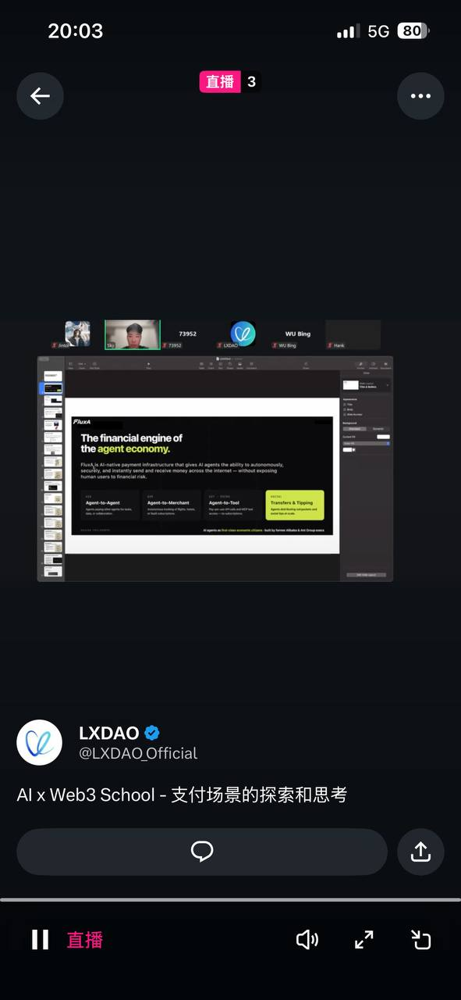

# Week 3｜实时参加 6.04｜支付场景的探索和思考

> 日期：2026-06-04  
> 活动：AI x Web3 School - 支付场景的探索和思考  
> 参与方式：X / Twitter 直播实时参加  
> 关联任务：Week 3｜线上活动｜实时参加 6.04｜支付场景的探索和思考  
> 隐私原则：本文只记录公开直播与个人学习总结，不包含会议密码、私钥、助记词、API Key、`.env` 或真实资金信息。

## 参与证明

我在 2026-06-04 晚上实时参加了 LXDAO / AI x Web3 School 的「支付场景的探索和思考」直播。

截图中可以看到：

- 直播账号：LXDAO / `@LXDAO_Official`
- 直播标题：AI x Web3 School - 支付场景的探索和思考
- 手机时间：20:03
- 直播状态：正在直播
- 分享内容中出现 `The financial engine of the agent economy`，围绕 Agent 支付、Agent-to-Agent、Agent-to-Merchant、Agent-to-Tool、Transfers & Tipping 等支付场景展开。



## 1 条关键信息

这场分享让我重新理解了 AI × Web3 支付场景的重点：

> Agent 支付不只是“让 AI 自动转账”，而是要把支付拆成可授权、可限额、可验证、可结算、可追溯的流程。

在 Agent economy 里，支付场景可能包括 Agent-to-Agent、Agent-to-Merchant、Agent-to-Tool，以及打赏、转账、订阅、资源采购等。真正难的不是发起一笔 payment，而是让 Agent 在明确边界里完成支付动作，并让用户、商家、工具方都能看到：谁授权、预算是多少、付款条件是什么、交付如何验收、失败或争议如何处理。

## 和我的项目方向的关系

这和我当前的 Hackathon 项目 YieldAgent 很相关。

YieldAgent 不是要让 Agent 直接拿用户钱包去追求收益，而是希望通过 Cobo CAW / Pact 先设定边界：

- 用户先设定可用预算、网络、资产、允许 Recipe 和有效期；
- Agent 只能在授权范围内执行收益策略或支付动作；
- 每次执行都需要留下 tx hash、状态变化和审计日志；
- 超额、非白名单、过期或被终止的动作必须被拒绝；
- 用户看到的不只是收益结果，还要看到权限边界和执行证据。

这场直播也提醒我：如果后续把 YieldAgent 扩展到收益分账、Agent 服务费或工具调用付费，不能只做一个“支付按钮”，而应该设计完整的 payment / commerce flow：报价、预算授权、执行、交付、验收、付款 / 退款 / 争议、记录证明。

## 下一步行动

我准备把这场分享里的支付视角补进 YieldAgent 的 Week 4 设计里：

1. 在 Pact Preview 里更清楚地展示预算、费用、分账和允许动作；
2. 在 Audit Log 里把 payment / revenue share / denied action 都作为一等记录；
3. 后续如果接 x402、CAW 或其他支付 SDK，先做 dry-run 和风险边界，再考虑真实测试网执行；
4. Demo 叙事从“Agent 帮我赚钱”调整为“Agent 在授权边界内完成可验证的链上经济动作”。

## WCB Proof 草稿

```text
这场分享让我重新理解了 AI × Web3 支付场景的重点：Agent 支付不只是“让 AI 自动转账”，而是要把支付拆成可授权、可限额、可验证、可结算、可追溯的流程。Agent economy 中会出现 Agent-to-Agent、Agent-to-Merchant、Agent-to-Tool、Transfers & Tipping 等场景，真正关键的是谁授权、预算是多少、付款条件是什么、交付如何验收、失败或争议如何处理。

这和我的 YieldAgent 项目很相关：YieldAgent 需要通过 Cobo CAW / Pact 先设定预算、资产、网络、允许 Recipe、期限和分账比例，让 Agent 只能在边界内执行收益策略或支付动作，并把 tx hash、状态变化和审计日志展示出来。下一步我会把支付视角补进 Pact Preview、Audit Log 和 revenue share 设计中。

Proof：
https://github.com/baikingrio/ai-web3-school-note/blob/main/submissions/week3-live-0604-payment-scenarios.md
```
