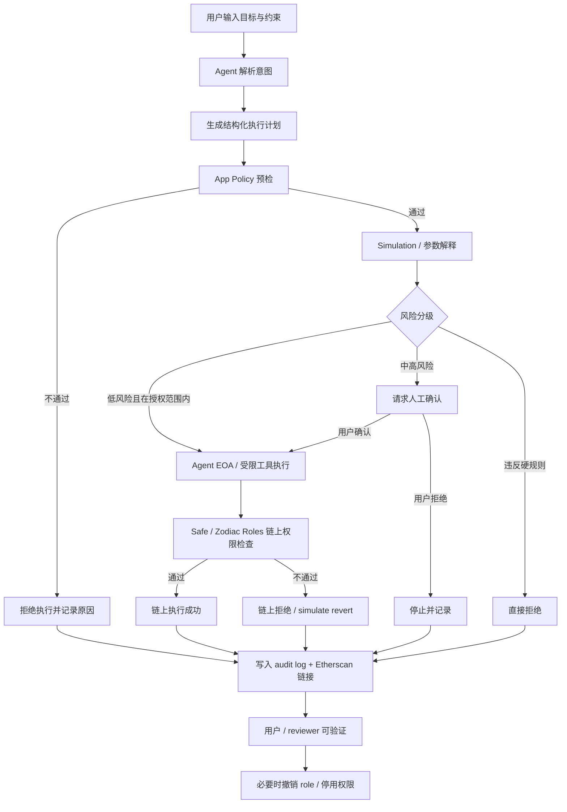

# Week 2｜Wallet / Permission｜Agent 链上动作权限策略

> WCB 任务：Week 2｜Wallet / Permission｜Agent 链上动作权限策略  
> 学员：Quinn / baikingrio  
> 关联项目：AgentScoope Wallet｜Agent 受限执行钱包  
> 关联实验目录：`experiments/agent-wallet/`  
> 公开仓库：https://github.com/baikingrio/ai-web3-school-note

## 1. 本任务目标

本任务围绕 Week 2 Module D：Wallet / Permission / Safe Execution，目标是回答：

> 当 AI Agent 发起链上动作时，如何限制它能做什么、不能做什么、哪些步骤可以自动化、哪些步骤必须由人确认，以及执行后如何验证、撤销和审计？

我选择使用自己的 Hackathon 项目 **AgentScoope Wallet** 作为分析对象。

项目目标是：

> 让 AI Agent 只能在用户预先定义的链上权限边界内执行小额、可审计、可撤销的操作；超出边界时由 Policy / Safe / Zodiac Roles 明确拒绝，而不是让 AI 直接控制用户资产。

Week 1 我已经完成了 AgentScoope Wallet v0.3 demo，基于 **Sepolia Safe + Zodiac Roles Modifier** 验证了：

- Agent 不是 Safe owner，只是受限 role member；
- 只允许调用白名单 USDC `transfer`；
- 额度内交易可以执行；
- 超额交易会被拒绝；
- 非白名单地址会被拒绝；
- 跳过 app policy 后，链上 Zodiac Roles 仍然会拒绝；
- 撤销 role 后，Agent 再执行会失败；
- 每次执行或拒绝都会写入结构化审计日志。

---

## 2. Agent 链上动作执行流程图

### 2.1 高层流程



### 2.2 分层说明

```text
用户 / Safe Owner
  └─ 设定授权边界：预算、白名单、时间窗口、可调用方法、撤销规则

Agent 层
  └─ 理解用户目标，生成结构化计划，不接触 owner 私钥

App Policy 层
  └─ 检查金额、目标地址、合约、方法、频率、时间窗口

Simulation 层
  └─ 在广播前解释：要付多少、调哪个合约、改哪些状态、可能失败原因

Safe / Zodiac Roles 层
  └─ 链上裁决：只有 role 允许的目标、方法、参数和额度才能执行

Audit 层
  └─ 记录 executed / rejected、reason、rejectLayer、tx hash、policy snapshot
```

---

## 3. 哪些步骤可以自动化，哪些必须人工确认

### 3.1 可以自动化的步骤

以下动作可以由 Agent 或脚本自动完成，因为它们不直接改变真实资产控制权，或已经处于严格授权范围内：

1. **理解用户目标**  
   例如用户说：“帮我向白名单 API 服务支付 0.5 USDC 测试网费用”。

2. **生成结构化执行计划**  
   输出目标链、token、合约地址、方法、收款方、金额、预期结果。

3. **应用层 policy check**  
   检查是否满足：白名单地址、允许方法、单笔额度、日额度、时间窗口。

4. **simulation / dry-run**  
   在真实广播前模拟执行，生成可读摘要。

5. **低风险测试网交易执行**  
   仅限满足以下条件：
   - Sepolia 测试网；
   - 金额在预算内；
   - 目标地址在白名单；
   - 方法在 allowlist；
   - 由受限 Agent EOA / role member 执行；
   - 不使用 Safe owner 私钥；
   - 失败时有明确 rejection reason。

6. **审计日志记录**  
   自动记录每次执行或拒绝：`decision`、`reason`、`rejectLayer`、`txHash`、`policySnapshot`。

### 3.2 必须人工确认的步骤

以下动作必须人工确认，不能让 Agent 自动完成：

1. **创建 / 修改 Safe 或权限模块配置**  
   例如启用 module、修改 role、增加白名单、提高预算。

2. **超过预算或接近预算上限的交易**  
   例如从 0.5 USDC 改成 5 USDC 以上，或突破单笔 / 日限额。

3. **向新地址或非白名单地址支付**  
   即使 Agent 给出理由，也不能自动放行。

4. **调用新的合约或新的方法**  
   特别是 `approve`、`setApprovalForAll`、升级函数、管理函数。

5. **真实主网资金操作**  
   任何主网资金、真实资产、NFT、治理票权都必须人工确认。

6. **撤销 / 恢复权限**  
   撤销是安全动作，但涉及权限状态变化，需要 owner 明确确认。

7. **任何涉及私钥、助记词、API Key、token、`.env` 的请求**  
   不是“确认后执行”，而是直接拒绝。

---

## 4. Agent Wallet 权限策略设计

### 4.1 策略目标

AgentScoope Wallet 的权限策略不是为了让 Agent 拥有“像人一样的钱包权限”，而是让 Agent 只能执行经过约束的、低风险的、可验证的任务。

策略原则：

1. **最小权限**：Agent 只获得完成当前任务所需的最小权限。
2. **默认拒绝**：未明确允许的合约、方法、地址和金额全部拒绝。
3. **链上裁决优先**：应用层 policy 可以提升 UX，但最终必须有 Safe / Roles / Guard 等链上或钱包层约束。
4. **越界不升级为“问用户是否继续”**：违反硬规则时直接拒绝，并记录原因。
5. **可撤销**：用户必须能随时撤销 Agent 的 role / session / module 权限。
6. **可审计**：每次成功和失败都要留下可复盘记录。

### 4.2 策略示例

```yaml
agent_wallet_policy:
  network: sepolia
  account:
    type: safe
    safe_address: "0x6896DDd6E05bA19d3f2697Ebb231A60d6d2F23b7"
  agent:
    role: agent_payer
    agent_address: "0x6Ab1a68c4a6Ba2384050Ed1411d9B91C30EC902E"
    is_safe_owner: false
  token:
    symbol: USDC
    address: "0x1c7D4B196Cb0C7B01d743Fbc6116a902379C7238"
  budget:
    max_per_tx: "1 USDC"
    max_daily: "5 USDC"
    time_window: "24h"
  allow:
    contracts:
      - "USDC token contract"
    methods:
      - "transfer(address,uint256)"
    recipients:
      - "pre-approved API / tool treasury address"
  deny:
    - mainnet_real_funds
    - safe_owner_private_key_access
    - seed_phrase_access
    - unlimited_approve
    - setApprovalForAll
    - transfer_to_unlisted_address
    - call_unknown_contract
    - contract_upgrade
    - governance_vote
    - modify_policy_without_owner_confirmation
  on_violation: reject
  logs:
    format: jsonl
    required_fields:
      - timestamp
      - user_intent
      - structured_plan
      - decision
      - reason
      - rejectLayer
      - txHash
      - policySnapshot
```

---

## 5. 人工确认阈值

我把 Agent 链上动作分成 4 个等级：

### L0：自动执行

条件：

- Sepolia 测试网；
- 目标地址在白名单；
- 方法在 allowlist；
- 金额低于单笔和日额度；
- simulation 与用户意图一致；
- 不涉及授权修改、合约升级、治理或主网资产。

行为：

- Agent 可以通过受限 role / module 执行；
- 执行后写入 audit log；
- 用户通过 Etherscan 和日志验证。

### L1：执行前确认

条件：

- 操作在大方向上合理，但存在中等风险；
- 例如接近预算上限、首次调用某个已知合约、修改非核心参数。

行为：

- Agent 只能生成计划和 simulation；
- 用户确认后才执行；
- 日志记录 human confirmation。

### L2：强制人工 / 多签确认

条件：

- 修改授权策略；
- 增加白名单；
- 提高额度；
- 启用 / 停用 module；
- 撤销或恢复 role；
- 涉及主网资产或团队金库。

行为：

- 必须 Safe owner / 多签确认；
- Agent 只能提供说明、calldata 摘要和风险提示。

### L3：直接拒绝

条件：

- 请求私钥、助记词、API Key、token、`.env`；
- 非白名单地址；
- 超额；
- 未允许方法；
- 无限 approve；
- 试图绕过 policy；
- 要求 Agent 直接控制 owner 钱包。

行为：

- 不请求用户二次放行；
- 直接拒绝；
- 记录 `reason` 和 `rejectLayer`。

---

## 6. 撤销方式与失败处理

### 6.1 撤销方式

AgentScoope Wallet 必须支持清晰的撤销路径：

1. **移除 Agent role member**  
   从 Zodiac Roles 的 `agent_payer` role 中移除 Agent EOA。

2. **禁用 Safe module**  
   如果需要彻底停用模块，可以由 Safe owner 禁用 module。

3. **清空 allowance / budget**  
   把额度设置为 0，或让 session 过期。

4. **移除 recipient / contract allowlist**  
   不再允许某个收款方或合约被 Agent 调用。

5. **暂停 app policy**  
   在应用层关闭自动执行，只保留 plan / simulate / explain。

### 6.2 失败处理

失败不应该被隐藏或简单归类为“交易失败”。每次失败都要记录具体层级和原因。

示例：

```json
{
  "scenario": "demo_over_limit",
  "decision": "rejected",
  "reason": "exceeds_allowance",
  "rejectLayer": "zodiac_roles",
  "txHash": null
}
```

常见失败类型：

- `exceeds_allowance`：超过额度；
- `transfer_to_unlisted_address`：收款方不在白名单；
- `method_not_allowed`：方法未被允许；
- `role_revoked`：Agent 权限已撤销；
- `simulation_failed`：模拟失败；
- `human_confirmation_required`：需要人工确认；
- `sensitive_secret_request`：请求敏感信息，直接拒绝。

---

## 7. ERC-4337、Safe、Guard / Policy 为什么重要

### 7.1 ERC-4337 / Account Abstraction

ERC-4337 代表账户抽象方向，让钱包不再只是 EOA 私钥控制的账户，而可以拥有更复杂的验证和执行逻辑。

对 Agent Wallet 的意义：

- 可以表达更细粒度的账户逻辑；
- 支持 session key、paymaster、batch transaction 等能力；
- 可以把“谁能执行什么”从单一私钥控制扩展成可编程策略。

它解决的风险：

- 降低 EOA 单点私钥风险；
- 让权限控制从“有私钥就全能”变成“满足策略才可执行”。

### 7.2 Safe / 多签 / 智能账户

Safe 是成熟的智能账户 / 多签基础设施。它适合 Agent Wallet 的原因是：

- owner 和 Agent 可以分离；
- Agent 不需要成为 Safe owner；
- 可以通过 module / guard / roles 扩展权限；
- 可以用多签管理高风险动作；
- 执行记录和配置可以公开验证。

它解决的风险：

- 防止 Agent 直接控制主账户；
- 支持团队确认和撤销；
- 让高风险动作回到 owner / 多签手里。

### 7.3 Guard / Policy / Zodiac Roles

Guard / Policy / Zodiac Roles 是 Agent 受限执行的关键。

它们的作用：

- 限制可调用合约；
- 限制可调用方法；
- 限制金额、频率和收款方；
- 在越界时拒绝；
- 为拒绝原因和审计提供结构化依据。

它们解决的风险：

- 防止 prompt injection 导致 Agent 调用错误目标；
- 防止超额执行；
- 防止非白名单转账；
- 防止应用层 policy 被绕过；
- 防止“AI 说可以，所以就执行”的危险路径。

---

## 8. 与 AgentScoope Wallet v0.3 的对应关系

Week 1 v0.3 已经验证了以下路径：

| 场景 | 决策 | 原因 | 拒绝层 |
|---|---|---|---|
| 额度内白名单转账 | executed | - | - |
| 超额转账 | rejected | `exceeds_allowance` | `zodiac_roles` |
| 非白名单地址 | rejected | `transfer_to_unlisted_address` | `app_policy` |
| 跳过 app policy 后非白名单地址 | rejected | `transfer_to_unlisted_address` | `zodiac_roles` |
| 撤销 role 后执行 | rejected | `role_revoked` | `zodiac_roles` |

链上成功执行 proof：

https://sepolia.etherscan.io/tx/0x70583881b975348b89609459dba6e2ab7c5c21a59c647291a541cc36646914b5

审计日志：

https://github.com/baikingrio/ai-web3-school-note/blob/main/experiments/agent-wallet/logs/pow-audit-v0.3.jsonl

---

## 9. Week 3 / v0.4 下一步

Week 2 的权限策略会进入 Week 3 / Hackathon 的 v0.4 实现计划。

目标是把 v0.3 的脚本 demo 升级为一个更完整的 Agent Tool Calling Flow：

```text
intent
  → plan
  → policy check
  → simulation
  → risk classification
  → human confirmation if needed
  → execute or reject
  → audit log
```

v0.4 计划补充：

1. **Intent parser**：把用户自然语言目标转换成结构化计划。
2. **Plan schema**：明确 chain、token、recipient、amount、method、riskLevel。
3. **Policy engine**：复用 v0.3 的 app policy，并明确 `onViolation: reject`。
4. **Simulation summary**：给用户和 reviewer 可读摘要。
5. **Tool calling adapter**：Agent 只能调用受限工具，而不是直接拿私钥执行。
6. **Audit log viewer**：让成功和失败都能被复盘。

---

## 10. 隐私与安全说明

本文件只包含公开学习笔记、测试网地址、公开交易链接和权限策略设计，不包含私钥、助记词、API Key、token、`.env` 文件、会议密码或任何敏感信息。
