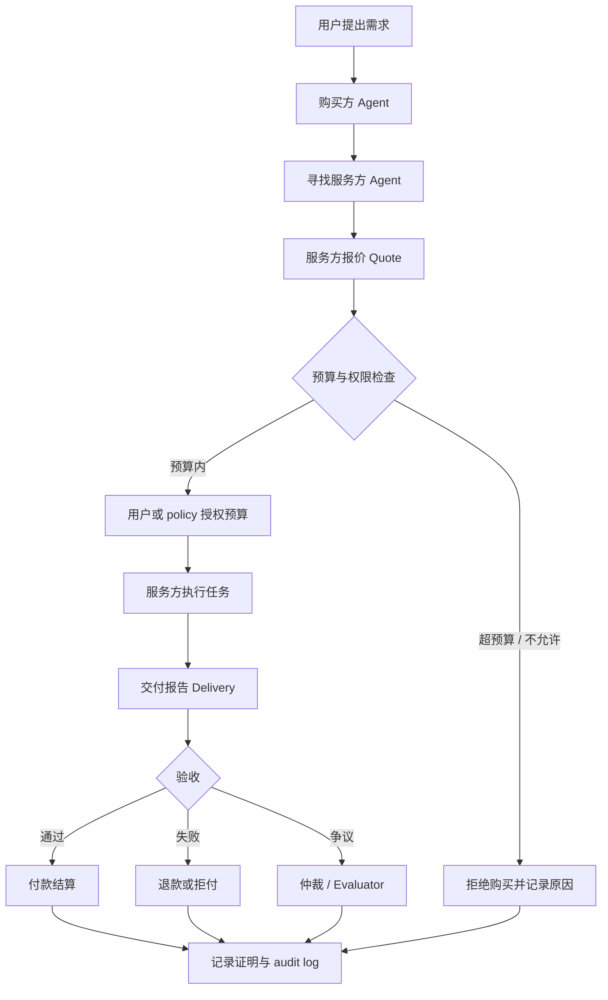

# Week 2｜Payment / Commerce｜最小支付与商业流程拆解

> WCB 任务：Week 2｜Payment / Commerce｜最小支付与商业流程拆解  
> Task ID：`cmpkl64w9nbg5mu01jev746ru`  
> 学员：Quinn / baikingrio  
> 关联项目：AgentScoope Wallet｜Agent 受限执行钱包  
> 公开仓库：https://github.com/baikingrio/ai-web3-school-note

## 1. 任务目标

这个任务要求选择一个“agent 帮人完成任务并收款”的场景，拆出完整的 payment / commerce flow。

我理解这个任务的重点不是证明“Agent 能不能付款”，而是看清楚一笔 Agent 参与的商业活动里，除了付款以外还需要哪些环节：

- 谁下单；
- 谁执行；
- 谁验收；
- 谁付款；
- 谁仲裁；
- 如何报价；
- 如何授权预算；
- 如何交付；
- 如何处理退款和争议；
- 如何留下可验证记录。

这和普通 payment 不一样。Payment 只是转账，commerce 还包含服务发现、报价、执行、交付、验收、争议处理和结算。

## 2. 选择场景

我选择的场景是：

> **AI Agent 帮用户购买一份链上交易 / Safe 操作风险分析报告。**

用户想检查某笔 Safe 交易或钱包操作是否安全，例如是否涉及非白名单地址、无限 approve、未知合约调用、超预算付款或可疑 calldata。用户授权一个购买方 Agent 在预算内寻找服务方 Agent，购买一份风险分析报告。

这个场景适合做最小 payment / commerce flow，因为它同时包含：

- 明确的需求：检查一笔交易或 Safe 操作；
- 明确的服务：风险分析报告；
- 明确的价格：例如 2 USDC；
- 明确的交付物：Markdown 报告 / JSON 结果；
- 明确的验收标准：是否包含目标地址、方法、金额、风险等级和建议；
- 明确的付款条件：验收通过后付款；
- 明确的争议点：报告缺字段、解释错误、交付超时。

它也和我的 AgentScoope Wallet 方向有关系：AgentScoope 关注 Agent 如何安全付款，而这个任务关注 Agent 为什么付款、付款前后需要什么商业流程。

## 3. 参与方

## 3.1 用户 / 需求方

用户提出需求，例如：

> 帮我检查这笔 Safe 交易是否安全，预算不超过 3 USDC。

用户关心的是结果是否可信，而不是底层支付流程。

## 3.2 购买方 Agent

购买方 Agent 代表用户完成以下动作：

- 理解用户需求；
- 寻找服务方；
- 读取报价；
- 检查预算；
- 请求用户授权或调用预授权预算；
- 接收交付物；
- 协助验收；
- 在符合规则时付款；
- 记录 proof。

购买方 Agent 不能无限付款，也不能给任意服务方付款。它必须受预算、白名单、时间窗口和人工确认策略限制。

## 3.3 服务方 Agent

服务方 Agent 提供链上风险分析服务，输出报告。

它需要说明：

- 服务内容；
- 报价；
- 交付时间；
- 交付格式；
- 验收标准；
- 退款条件。

## 3.4 验收方

MVP 阶段，验收方可以是用户本人。  
进阶版本，可以引入 evaluator 或自动规则检查。

例如自动规则可以检查报告是否包含：

- 交易目标地址；
- 合约方法；
- token / amount；
- 风险等级；
- 建议动作；
- 失败或不确定说明。

## 3.5 支付 / 结算层

MVP 可以使用测试网 USDC 付款，或者先只设计流程。

结算记录至少应该包含：

- quote ID；
- budget authorization；
- delivery ID；
- acceptance result；
- payment / refund tx；
- audit log。

## 3.6 仲裁方

MVP 阶段可以是人工仲裁。  
进阶版本可以是第三方 evaluator、信誉系统、escrow 或 dispute module。

仲裁方主要处理：

- 服务方是否按时交付；
- 交付物是否满足标准；
- 用户是否恶意拒付；
- 是否应该付款、退款或部分付款。

## 4. 最小商业流程

## 4.1 发现服务

用户提出需求后，购买方 Agent 找到一个服务方 Agent：

```text
Service: Safe transaction risk report
Description: Analyze a Safe transaction and return risk level + recommendation
Price: 2 USDC
Delivery time: 10 minutes
Delivery format: Markdown report or JSON summary
```

这一步解决的是：用户想买什么服务，以及哪个服务方可以提供。

## 4.2 报价 Quote

服务方 Agent 返回结构化报价：

```text
Quote ID: quote-001
Task: Safe transaction risk report
Input: safe transaction hash / calldata / target address
Price: 2 USDC
Deadline: 10 minutes
Delivery: Markdown report
Acceptance criteria:
- target contract identified
- method decoded or uncertainty explained
- token / amount explained if applicable
- risk level included
- recommendation included
Refund rule:
- refund if no usable report is delivered
```

报价不是一句“2 USDC”，还要包含交付物、验收标准和失败处理。

## 4.3 预算授权

用户或系统给购买方 Agent 一个预算：

```yaml
budget_authorization:
  max_total: 3 USDC
  max_per_task: 2 USDC
  token: USDC
  valid_until: 30 minutes
  allowed_service_type: Safe transaction risk report
  allowed_provider: selected_service_agent
  require_human_confirmation_above: 2 USDC
```

这一步很重要，因为 Agent 不能因为看到报价就直接付款。它必须先检查：

- 是否超过总预算；
- 是否超过单次任务预算；
- 服务方是否允许；
- token 是否允许；
- 时间窗口是否有效；
- 是否需要人工确认。

## 4.4 执行任务

服务方 Agent 执行风险分析：

1. 读取交易目标地址；
2. 解析 calldata；
3. 判断是否涉及 transfer、approve、delegatecall、合约升级等动作；
4. 检查收款地址或合约是否可信；
5. 检查金额、token 和权限变化；
6. 输出风险等级和建议。

服务方不能只返回“看起来安全”，而要返回可验收的结构化结果。

## 4.5 交付 Delivery

服务方 Agent 交付报告：

```text
Delivery ID: delivery-001
Quote ID: quote-001
Report hash / URL: ...
Summary:
- Target: USDC contract
- Action: transfer
- Amount: 0.5 USDC
- Recipient: whitelisted address
- Risk level: Low
- Recommendation: can proceed under current policy
```

交付物需要能被用户或 evaluator 复查。

## 4.6 验收 Acceptance

验收分为两层。

### 自动验收

检查报告是否满足最低结构：

- 是否有 target；
- 是否有 action / method；
- 是否有 amount / token，如适用；
- 是否有 risk level；
- 是否有 recommendation；
- 是否说明不确定项。

### 人工验收

用户确认报告是否有用，是否满足购买目的。

MVP 规则可以是：

```text
如果报告字段完整，并且用户未在 10 分钟内提出争议，则验收通过。
如果报告缺少关键字段、交付超时或明显分析错误，则进入退款 / 争议流程。
```

## 4.7 付款 Payment

验收通过后，购买方 Agent 在预算范围内付款：

```text
Pay 2 USDC to service provider
Reason: Safe transaction risk report
Quote ID: quote-001
Delivery ID: delivery-001
Acceptance: passed
```

付款记录需要关联 quote 和 delivery，否则只有 tx hash 很难说明为什么付钱。

## 4.8 退款 / 争议 Refund / Dispute

如果服务方没有交付，或交付物不符合标准：

```text
Dispute reason:
- delivery timeout
- missing risk level
- missing calldata explanation
- wrong transaction target
- report is unusable
```

处理方式：

- 未交付：自动退款或不付款；
- 交付不完整：用户申请退款；
- 双方争议：交给 evaluator / 人工仲裁；
- 仲裁结果写入记录。

## 4.9 记录证明 Proof of Record

最终需要保留一组记录，而不是只保留付款结果：

```text
Quote record
Budget authorization
Execution status
Delivery record
Acceptance result
Payment / refund tx
Dispute result if any
Audit log
```

这些记录可以用 GitHub、链上 tx、数据库、签名 receipt 或 attestation 保存。MVP 阶段可以先用 Markdown + JSON audit log 表达。

## 5. 流程图



## 6. 付款 / 退款 / 争议规则

## 6.1 付款条件

付款需要同时满足：

- 报价在预算内；
- 服务方在允许范围内；
- 交付物存在；
- 验收通过；
- 没有未解决争议；
- audit log 可记录；
- 如触发人工确认阈值，用户已确认。

## 6.2 退款或拒付条件

出现以下情况时，进入退款或拒付：

- 服务方未按时交付；
- 报告缺少关键字段；
- 报告分析对象错误；
- 报告明显无法用于决策；
- 服务方试图改变报价；
- 服务方要求绕过预算或直接索要私钥、API key 等敏感信息。

## 6.3 争议处理

争议处理需要明确：

- 争议由谁发起；
- 证据是什么；
- evaluator 或仲裁方是谁；
- 是否部分付款；
- 结果如何记录。

MVP 可以采用人工仲裁，后续再引入 evaluator / reputation。

## 7. x402 与 MPP 简要比较

## 7.1 x402 解决哪一段

x402 更像是 API / HTTP 层的机器支付入口。

它适合解决：

- 服务方如何声明“这个接口需要付款”；
- 请求方如何识别付款要求；
- 如何完成一次 API 访问前的小额付款；
- 付款后如何获得接口结果。

放在本流程里，x402 主要覆盖：

```text
服务方付款要求 → 购买方识别付款条件 → 完成付款 → 获取接口结果
```

它比较适合付费 API、付费数据、付费推理接口这类场景。

但 x402 不一定完整解决：

- 任务质量验收；
- 复杂争议；
- 服务方长期信誉；
- 多步骤 escrow；
- Agent 的钱包权限和预算安全。

## 7.2 MPP 解决哪一段

MPP 更像是面向机器和 Agent 的支付协议框架，关注 agent commerce 中付款请求、支付方式、确认和商家集成。

它适合解决：

- Agent 如何理解付款请求；
- 商家如何把付款要求表达给机器；
- 支付方式如何被选择；
- 付款确认如何返回给服务方；
- agent-driven commerce 如何和现有支付系统对接。

放在本流程里，MPP 主要覆盖：

```text
报价 / checkout / payment request / payment confirmation
```

MPP 比 x402 更偏商业支付接口和支付流程抽象，但它同样不能单独解决完整 commerce flow。

## 7.3 我的判断

x402 和 MPP 都很有价值，但它们解决的主要是“付款入口”和“支付请求 / 确认”这段。

完整 Agent Commerce 还需要：

- 预算授权；
- 权限控制；
- 交付验收；
- 退款规则；
- 争议处理；
- reputation / evaluator；
- audit log；
- 安全的钱包执行层。

所以我认为：

> x402 / MPP 可以解决 Agent Commerce 中的 payment interface，但不能替代完整的 commerce workflow。

## 8. 和 AgentScoope Wallet 的关系

这个任务让我更清楚地区分了两个层次：

1. **Payment / Commerce flow 说明 Agent 为什么付款、为谁付款、付款前后如何验收和追责。**
2. **AgentScoope Wallet 说明 Agent 如何在安全边界内付款。**

对我的 AgentScoope Wallet 来说，这个任务提醒我：不能只做一个“安全转账工具”。如果 Agent 真要进入商业流程，还要知道这笔付款对应哪个 quote、哪个 delivery、哪个 acceptance result，以及失败后如何退款或仲裁。

否则只有 tx hash，不等于完整商业闭环。

所以后续如果把 AgentScoope 用到 bounty、API purchase 或服务采购场景里，需要在 audit log 里增加业务字段，例如：

```json
{
  "quoteId": "quote-001",
  "deliveryId": "delivery-001",
  "acceptance": "passed",
  "paymentReason": "Safe transaction risk report",
  "txHash": "0x..."
}
```

这样付款记录才能从“链上转账证明”升级为“商业流程证明”。

## 9. 最小验证计划

MVP 不一定马上做完整协议集成，可以先用一个 mock flow 验证：

1. 准备一个模拟 Safe 交易作为输入；
2. 创建一个 mock quote；
3. 用户授权 3 USDC 预算；
4. 服务方 Agent 输出一份风险分析报告；
5. 自动检查报告字段；
6. 用户确认验收；
7. Agent 在测试网执行 2 USDC 付款，或先用 dry-run 记录；
8. 生成 quote / delivery / acceptance / tx / audit log 记录。

验证重点不是“支付是否酷炫”，而是：

- 预算有没有被检查；
- 交付物有没有验收；
- 付款是否和业务原因绑定；
- 失败时有没有退款 / 争议路径；
- 记录是否足够复盘。

## 10. 风险与边界

这个场景的主要风险：

- Agent 购买了错误服务；
- 服务方交付质量难以自动判断；
- 用户恶意拒付；
- 服务方恶意骗取付款；
- 报价和交付标准不清；
- 只有支付，没有验收和争议；
- Agent 支付权限过大；
- 付款记录和业务原因脱节。

控制方法：

- 小额预算；
- 服务方白名单；
- 明确 quote；
- 明确验收字段；
- 支付前 simulation；
- 人工确认阈值；
- 退款 / 争议规则；
- audit log；
- 不碰主网真实资金。

## 11. 结论

我对这个方向的结论是：

> Agent Commerce 的关键不是“让 Agent 自动付款”，而是让 Agent 在明确报价、预算授权、交付验收、争议处理和可验证记录的链路里完成交易。

Payment / Commerce 和 Wallet / Permission 是互补的：前者定义商业流程，后者定义安全执行边界。对 AgentScoope Wallet 来说，未来如果要支持 bounty、API purchase 或 agent service payment，就需要把 quote、delivery、acceptance 和 dispute 这些业务字段纳入 audit log，而不仅仅记录 tx hash。

## 12. 隐私与安全说明

本笔记只包含课程分析、流程设计和公开参考链接，不包含私钥、助记词、API Key、token、`.env`、RPC URL、真实资金账户信息或其他敏感内容。所有支付示例都以测试网或模拟流程为前提。
